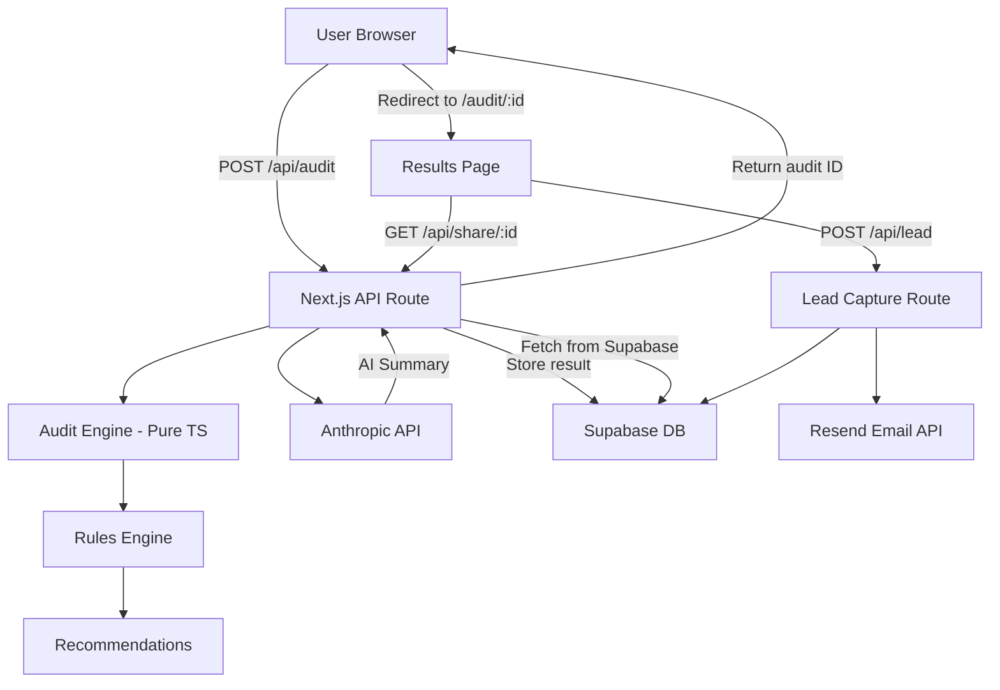

# Architecture

## System Diagram

## Data Flow

1. User fills form → browser sends `AuditInput` JSON to `/api/audit`
2. Server runs rules-based `auditEngine.ts` — no AI, pure logic
3. Server calls Anthropic API for 100-word human-readable summary (falls back to template on failure)
4. Full `AuditResult` stored in Supabase `audits` table with a `nanoid` primary key
5. Client redirects to `/audit/:id` which fetches from `/api/share/:id`
6. Share endpoint strips PII before returning to browser
7. User submits email → `/api/lead` stores in `leads` table and sends Resend confirmation

## Stack Choices

| Layer | Choice | Reason |
|---|---|---|
| Framework | Next.js 14 (App Router) | SSR metadata for OG tags, API routes for secret keys, single repo |
| Language | TypeScript | Type-safe audit logic means no silent math errors |
| Styling | Tailwind CSS | Fast iteration, no CSS files to maintain |
| Database | Supabase | Free tier, no ops, Postgres under the hood |
| Email | Resend | Simple API, great DX, free tier covers MVP volume |
| Deploy | Vercel | Zero-config Next.js deploy, free tier |
| AI | Anthropic claude-sonnet | Assignment requirement; best instruction-following for summary task |

## Scaling to 10k Audits/Day

- **Database:** Add Supabase connection pooling (PgBouncer). Index `leads.email` and `audits.created_at`.
- **AI Summary:** Move to async queue (Inngest/BullMQ) — don't block the audit response on LLM latency.
- **Rate limiting:** Replace in-memory map with Redis (Upstash) — in-memory doesn't survive serverless restarts.
- **Caching:** Cache pricing data in Redis with 24h TTL — pricing rarely changes.
- **Edge:** Move `/api/share/:id` to Vercel Edge Functions for lower latency on share URL fetches.
